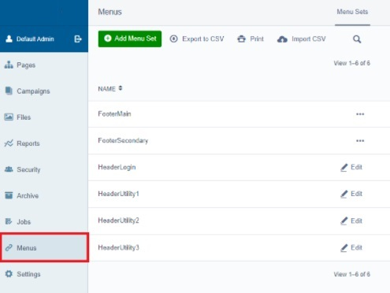
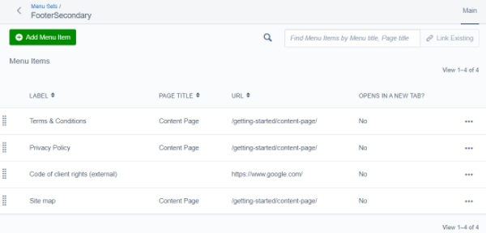
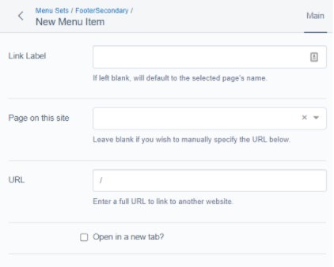

[ClassName]: / (InformationManagement)
[Title]: / (Menus and Menu sets)
[Description]: / (Menus and Menu sets for creating groups of links on site-wide features)

# Menus and Menu sets

<!-- ToDo: If your project does not use the Menu Manager module at all, delete this file -->

## Menu sets
Menu sets are collections of links used in specific places in the site, e.g. the header and footer. All are configured the same way.

The Menus menu in the CMS sidebar has a collection of existing menu sets, each of which contains a different set of Menu Items:
* **ExampleMenuSetName**: (describe where the items in this menu set appear)
<!-- Example:
* **FooterMain**: the text links that appear in columns in the top half of the footer
* **FooterSecondary**: the text links that appear in a row in the bottom half of the footer.
 -->

<!-- Example for if one or more menu sets have custom fields that are described on that feature's page: 
* The header items contain some additional fields; see **Header > Header Links** for details on those custom fields.
-->

_Note:_ It is important that these menu sets are not deleted or renamed, or the site will not be able to load their contents. If a menu set is deleted by accident, it can be re-created with the same name. Please note that the list of menus is ordered by date of creation, not alphabetically, so new menu sets will always be at the end.

_CMS Menus manager_
<!-- TODO: Update this screenshot with one appropriate for your project, as this has e.g. "FooterMain" and "HeaderLogin" that are likely not relevant for your client. -->

## Menu items

Menu sets are essentially folders; menu items are the links within them. When you open a menu set you will see a table showing all its links. 

_Example menu set table, showing all the menu items (links) in that set_

These links can be rearranged by pressing the dotted drag-and-drop symbol on the far left of each row.

Some menu sets have notes indicating how many items will display in the header, footer, etc. Others have additional fields specific to that menu - see the sections for those features for details.

To add a new item, press the green Add Menu Item button. To edit an existing link, click on its row in the table. Both will open the menu item page.

_Example menu item page_

On the Menu Item page you can either select an existing **Page on this site**, or enter the **URL** of an external page manually. Either will populate the Link Label field automatically on save, or you can enter a different label; whatever is in this field is the text that will appear on the clickable item.
