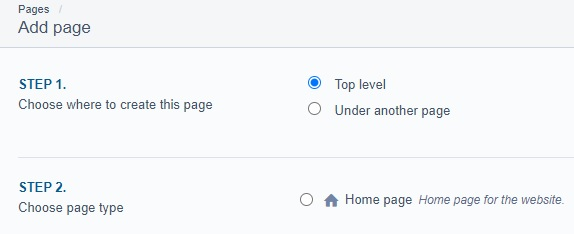

[ClassName]: / (Page)
[Title]: / (Pages)
[Description]: / (Pages intro and global page features)

# Pages

Many page types are available. Some, like the Home Page type, are restricted to certain parts of the site, while others can be used almost anywhere.

## General Page Feature

### Create a new page
To create a new page of any kind, go to the Pages menu and select **Add New**:

_Pages menu showing Add New button_

A page can be top-level or nested under another existing page. Some page types must be top-level, some must be nested, and some can be either. 

There are many types of pages for a variety of purposes; see the sections below for details on specific page types. Select the type of page you want and click Create. 

_Add New page showing the level and type selectors_

Different page types have different fields. See **Page Features** below for an overview of the most common fields. 

Once you have added content to your page, you can Save (which will save a draft) or Publish the page. 

### Page Features

At the top of every CMS page editor is a heading with the Page name and three tabs: Content, Settings, and History.
* The **Content** tab contains all the page's fields, and everything unique to a page type will be in that tab. See below for details.
* The **Settings** tab contains controls for the page's type, visibility and permissions. See below for details.
* The **History** tab shows a list of saved and published versions of the page, and can be used to restore an older version if needed. 

_Page tabs_

#### Content Tab

All page types will have most of the following fields on the main Content tab:

* **Page name** (often called the **Title**): The name of the page; this will appear in the browser tab, and usually in the CMS site tree and the breadcrumbs.\
Note: Changing the page name will automatically update the URL segment and Navigation label fields to match, but these can be adjusted manually if preferred.
* **URL segment**: The URL that will lead to the page. This will be automatically updated if the Page Name is changed, but can also be changed manally by pressing the Edit button. 
* **Navigation label**: This rarely-used field matches the Page name by default, and will automatically update if the Page name is changed, but can be manually changed; this text is what appears in the CMS site tree.  <!-- OPTIONAL if breadcrumbs are used: "and in the page breadcrumbs." -->

Most pages also have an area for Content Blocks. See the **Content Blocks** section for more information on content blocks.

#### Settings Tab
The Settings tab contains the following fields:

* **Page type**: A dropdown menu from which to select a new Type for the page. 
Note: Changing a page's type will affect the fields and blocks available to it, and may cause errors. If possible, please create a new page instead.
* **Page location**: Where the page sits in the site tree. Use this to change whether the page is a top-level or sub-page. Alternatively, you can drag your page to a new position using the site tree.
* **Visibility**: These two checkboxes control where the page will appear in automatically-generated searches or menus. 
* **Who can view this page?** and W**ho can edit this page?**: Access permission controls. Usually, these are best left as "Inherit from site access settings".
