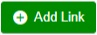
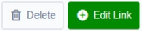
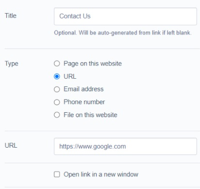

[ClassName]: / (SiteTools)
[Title]: / (Links)
[Description]: / (Link module for individual links throughout the site.)

# Links

<!-- ToDo: Depending on which link module is used for your project (e.g. Sheadawson, Gorricoe, Silverstripe-link), some of the below text or screenshots may be inaccurate; please check and update as appropriate. -->

Links appear throughout the site on many settings, pages and blocks. Most often they are created and managed using the **standard Link feature**, which appears as a field with a green button labelled **Add Link** - or, if a link already exists, **Edit** with an accompanying **Delete** button.

_Add Link button_

_Delete and Edit buttons_

When this button is clicked, it opens a pop-up window listing all the editable features of the link. These features can vary, but most have all the following base features:

_Standard Link editor (Page on this website option)_

* **Title**: The name of the link. Often this will be the clickable text that is visible on the front of the site.
* **Type**: This dropdown field will show all the available types of links, and which option is selected will affect which field follows it:
    * **Page on this website**, for internal site links. Selecting this shows the **Page** field, a dropdown which lists every page in the current site. Site pages with child pages have a ">" symbol on the left; click this to navigate the child pages until you find the page you want.
    * **URL**, for external site links. Selecting this shows the **URL** field, a text field in which to type the full site address of the target site (e.g. http://www.google.co.nz).
    * **Email address** shows the **Email Address** field. When this kind of link is created, clicking the text will trigger the user's email app or browser.
    * **Phone number** shows the **Phone Number** field. When this kind of link is created, clicking the text will trigger the user's phone app or browser. Use the Title field for spaced versions of the phone number; the Number field does not accept spaces. Special characters such as "+" are accepted.
    * **File on this website**, for files already uploaded to the site in the Files menu. This shows the **File** dropdown, which works like the **Page** dropdown.
* **Open link in new window**: A checkbox that will open the link, regardless of type, in a new tab/window.

Note that when these features vary (e.g if. the Title text is not visible to users), the notes specifying changes do not appear within the pop-up; please check for notes under the Add Link button.
