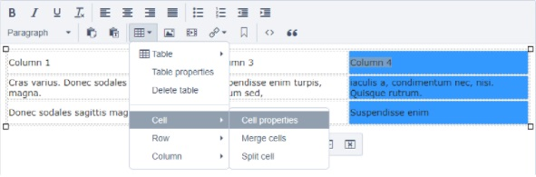

[ClassName]: / (SiteTools)
[Title]: / (Rich Text Editor)
[Description]: / (also known as the WYSIWYG, or What You See Is What You Get.)

# Rich Text Editor

The Rich Text Editor is a free text field interface with a lot of formatting options; it is in every Content Block, and in a number of other places around the site, including some site-wide settings. 

Most features are self-explanatory, but some can have odd gotchas. Here below are some of the easier-to-miss features, plus tips and tricks on how to use them most easily.

## Images

To add an image, press the Images icon:

_Images icon_

A pop-up window will open showing the files already uploaded to your CMS. Select one, or select **Upload** to use a new file. You will see a sidebar like this:

_Images sidebar_

Images can be configured with the following fields:
* **Alignment**: Where the image will sit in the page, in relation to the page and other elements:
    * **left**, **center** and **right** will sit on lines of their own
    * **left wrap** and **right wrap** will float next to whatever elements are nearby, e.g. the text of a nearby paragraph will wrap beside it. 
    * Note: Images should never be aligned by using the paragraph text alignment buttons.
* **Width/Height**: The size of the image. Only the width needs to be set as the height will update automatically to retain the proportions. An image will never appear wider than the set size, but will shrink responsively to fit the user's screen.
* **Caption**: The caption that will appear under the images (optional).
* **Alternative text**: Text that describes the image for users who cannot see it, e.g. vision impaired users who navigate with screen readers. This is required for the accessibility.

To edit an image in a content block, highlight the image and press the Image button. If you are having difficulty highlighting an image (images which are not aligned left are harder), place your cursor in adjacent text (e.g. the caption) and use the keyboard (shift + arrow keys) to select the image.

## Videos

To add a video, press the Video icon:

_Videos icon_

A pop-up window will open with a field for the video URL. 

Videos can be configured with the following fields:
* **Placement**: Where the video will sit in the page, in relation to the page and other elements:
    * **left**, **center** and **right** will sit on lines of their own
    * **left wrap** and **right wrap** will float next to whatever elements are nearby, e.g. the text of a nearby paragraph will wrap beside it. 
    * Note: Videos should never be aligned by using the paragraph text alignment buttons.
* **Width/Height**: The size of the video. Only the width needs to be set as the height will update automatically to retain the proportions. Videos will never appear wider than the set size, but will shrink responsively to fit the user's screen.
* **Caption**: The caption that will appear under the video.

_Video config screen_

To edit a video, press on the video and either press the toolbar Video icon or the Edit Media button in the pop-up below the video.

_Edit media button_

## Links in the Rich Text Editor

Text can be turned into a link by highlighting it and pressing the Link button:

_Link button menu_

Choose the type of link you want, fill out the details, and press **Insert Link**.

### Phone links
The Links dropdown has no labelled option for adding phone links, but they can still be made in a way that will trigger a phone app.

_Select "URL" option to create a phone link_

Highlight the text (number) as usual and select the "Link to external URL" option. In the "URL" field, type "tel:" before the number, e.g. "tel:+6434230000" - leave out any spaces and leave the other fields blank.

_Link to an external URL pop-up window with phone details_

Next, press the Source code button:

_Source code button_

Because the link creator thought this was a URL, it tries to be helpful by adding an initial "http://" to whatever text is inserted, but this will break phone links. To remove it, go to the Source code pop-up window, find your link, and remove the HTTP text from before your "tel:".

_Source code of the phone link with unwanted "http://" text highlighted._

Save, and the link will trigger a phone when pressed.

Alternatively, phone links can be created directly in the source code by inserting the following HTML:
`<a href="tel:0123456">012345</a>`

## Tables

Tables can be created or pasted into the rich text editor. 

Note: Pasted tables, especially from other websites or programmes like MS Word, can bring along debris code that will affect its appearance, e.g. your row and column widths and heights.

### Creating a table

To create a table, press the table button and select the number of columns and rows you need; more can always be added or deleted later.

_Creating a table with the table menu_

Paste or type content into each cell. Note that when you are in a cell, a hovering row of buttons will appear with controls for the table, or for the row or column you are in. Hover over each button to see its function.

_A new table with one cell populated, showing the row of hover buttons_

Table controls can also be found in the drop-down menu:

_Table dropdown menu_

### Resizing tables, columns or cells

Table height is determined by its content, and will adjust responsively to the viewport on which it is viewed.

Table width, and the width of specific table cells or columns, default to their content but can also be set manually. By default, tables use the full width of the content block. 

_Note:_ All sizes must be in **percentages**. Any number without a percentage sign will be treated as pixels, which can break the page design. 

To resize the entire table, go to **Table properties** and fill the **Width** field:

_Table menu > Table properties_

To resize a column, highlight all cells in that column and go to Cell -> Cell properties.

_All cells in column 4 of a table are highlighted, with Table menu > Cell > Cell properties open_

_Table menu > Cell > Cell properties_

_IMPORTANT_: When **pasting** a table from another source, e.g. another website or Word, existing sizes are often imported as pixels. Whenever pasting a table into the editor, check the Table properties to ensure that the width field is either blank or populated with a percentage.

### Adding a header for accessible tables

When creating a table the first row should contain the column headers and the row type should be set to Header. This makes it easier for screen reader users.

To define a header row:
* Create the table with the first row containing column headers.
* Highlight the first row, right press and select **Row | Row Properties** from the popup menu
* Set the **Row Type** to be **Header** and press OK.

_Header row highlighted with Row Properties popup open._

